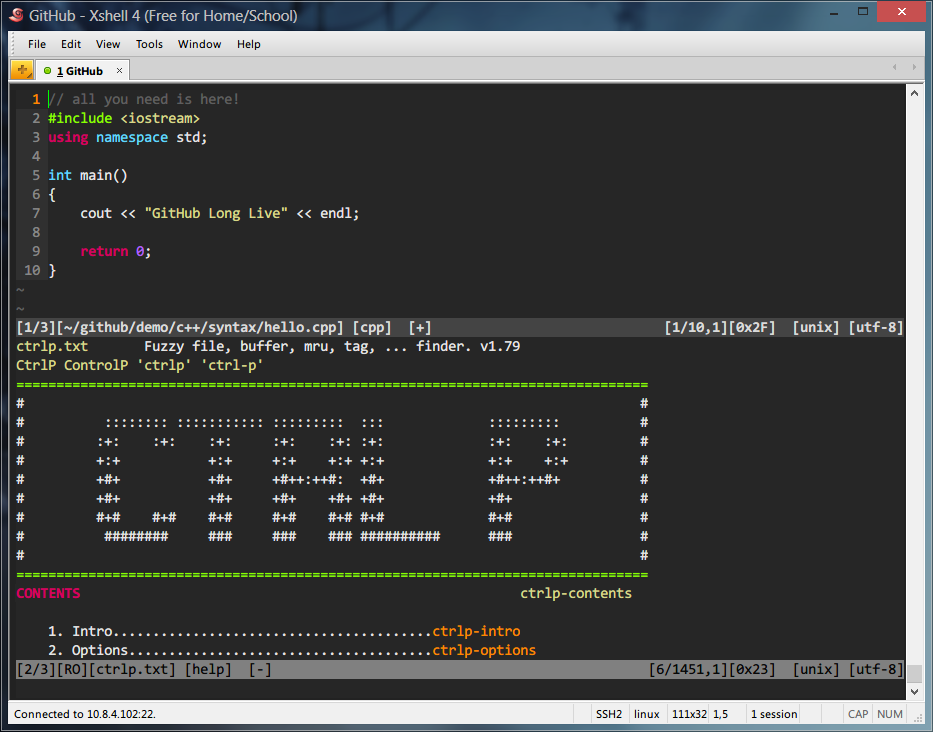

# dotfiles

Backup, restore, and sync the prefs and settings for my toolbox.

## Installation


#### Git

```
$ copy gitconfig ~/.gitconfig
```

#### Vim

###### 1. install vimrc

```
$ copy vimrc ~/.vimrc
```

###### 2. install vim plugin manager [Vundle](https://github.com/gmarik/Vundle.com)

```
$ git clone https://github.com/gmarik/Vundle.vim.git ~/.vim/bundle/Vundle.vim
```

Lauch `vim` and run `:VundleInstall`.

Now you can use your brand new and amazing **vim**. The color scheme is [molokai](https://github.com/tomasr/molokai), it works well in terminal vim(not GUI version such as GVim), you can refine molokai.vim to make molokai more monokai.



#### xShell

In menu **Tools**, open **Color Schemes** dialog, then **Import** xShell_color_scheme.xcs, select **taste** in color scheme list.


#### Sublime Text

Place these files in Packages/User directory.

* Windows `%HOMEPATH%\AppData\Roaming\Sublime Text 3\Packages\User`
* Linux `~/.config/sublime-text-3/Packages/User`

1. Preferences.sublime-settings ---- **Preferences > Setttings - User**
2. Package Control.sublime-settings ---- **Preferences > Package Settings > Package Control > Settings – User**, installed packages. (First install [Package Control](https://sublime.wbond.net))
3. Default(Windows).sublime-keymap ---- **Preferences > Key Bindings - User**

## Workflow

#### Vim

###### 1. vim-stripper

`:Strippper`: Strips trailing whitespaces current file or text selected in visual mode.

###### 2. NERDCommenter

`,cc`: Comments out the current line or text selected in visual mode.
`,cs`: Comments out the selected lines **sexily**.
`,cu`: Uncomments the selected line(s).
